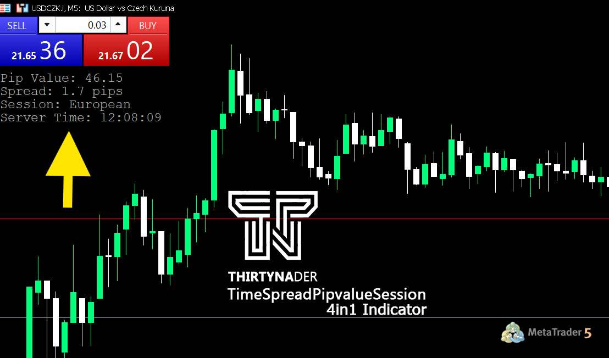
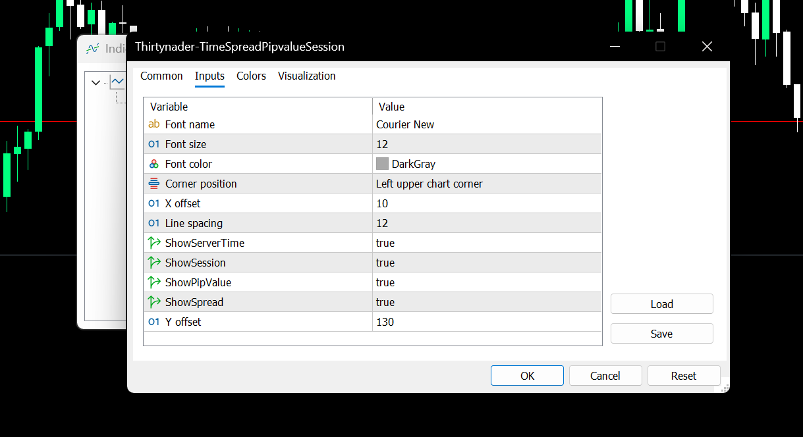

# 🧭 Thirtynader - TimeSpreadPipvalueSession (4-in-1 Indicator for MetaTrader 5)

A powerful, minimalist, and efficient **4-in-1 custom indicator** designed for professional traders using **MetaTrader 5 (MT5)**.  
The `TimeSpreadPipvalueSession` tool consolidates four essential trading insights into a compact on-screen display—so you can focus on what matters: the market.

---

## 🚀 Features

✅ **Pip Value** – Instantly see the current pip value for your active symbol.  
✅ **Spread Monitor** – Real-time spread display in pips.  
✅ **Session Identifier** – Automatically detects and displays the active trading session (Asian, European, US).  
✅ **Server Time** – Keeps you synced with broker time, visible directly on the chart.  

All elements are highly customizable, from font type and size to layout and visibility.

---

## ⚙️ Inputs & Customization

| Parameter         | Description                                          |
|------------------|------------------------------------------------------|
| `Font name`       | Font used for display text (e.g., Courier New)       |
| `Font size`       | Text size (default: 12)                              |
| `Font color`      | Color of the displayed information                   |
| `Corner position` | Screen corner for display positioning                |
| `X offset`        | Horizontal padding from the selected corner          |
| `Y offset`        | Vertical padding from the selected corner            |
| `Line spacing`    | Distance between lines of text                       |
| `ShowServerTime`  | Show/hide the broker's server time                   |
| `ShowSession`     | Show/hide current trading session                    |
| `ShowPipValue`    | Show/hide the pip value of the symbol                |
| `ShowSpread`      | Show/hide the current market spread                  |

---

## 🖼️ Visual Example

Below is an example of the indicator in action:

---

## 📦 Installation Guide

1. Download the `.ex5` file from the [Releases](https://github.com/Thirtynader/Thirtynader-TimeSpreadPipvalueSession/releases/) section or clone the repository.
2. Copy the file to your **MetaTrader 5** `Indicators` directory:  
   `MQL5/Indicators/`
3. Restart MetaTrader 5.
4. In the **Navigator Panel**, locate `Thirtynader-TimeSpreadPipvalueSession`.
5. Drag and drop it onto any chart.
6. Customize settings as needed.

---

## 📝 Notes

- This indicator is compiled only for MetaTrader 5 (`.ex5`).  
- Source code (`.mq5`) is **not** included in this repository.  
- Designed for traders who need quick, unobtrusive insights without overloading the chart.

---

## 📄 License

This project is licensed under a **Free for Personal Use** license. Redistribution, decompilation, or commercial use without permission is prohibited.

If you find this tool useful, feel free to ⭐️ star the repo or share it with fellow traders.

---

## 🙌 Credits

Developed by **Thirtynader**  
For feedback, improvements, or collaboration, open an issue or contact via GitHub.

---

